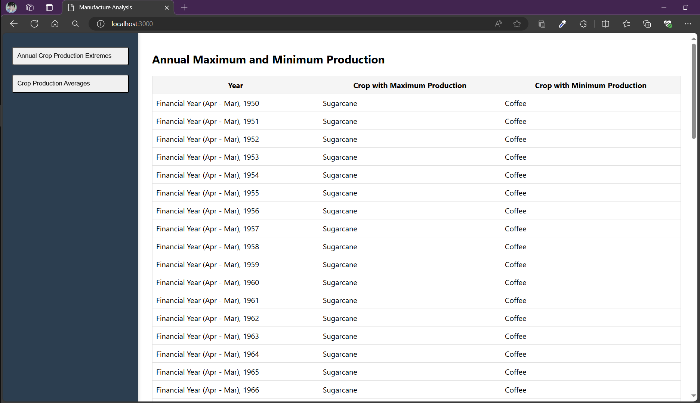
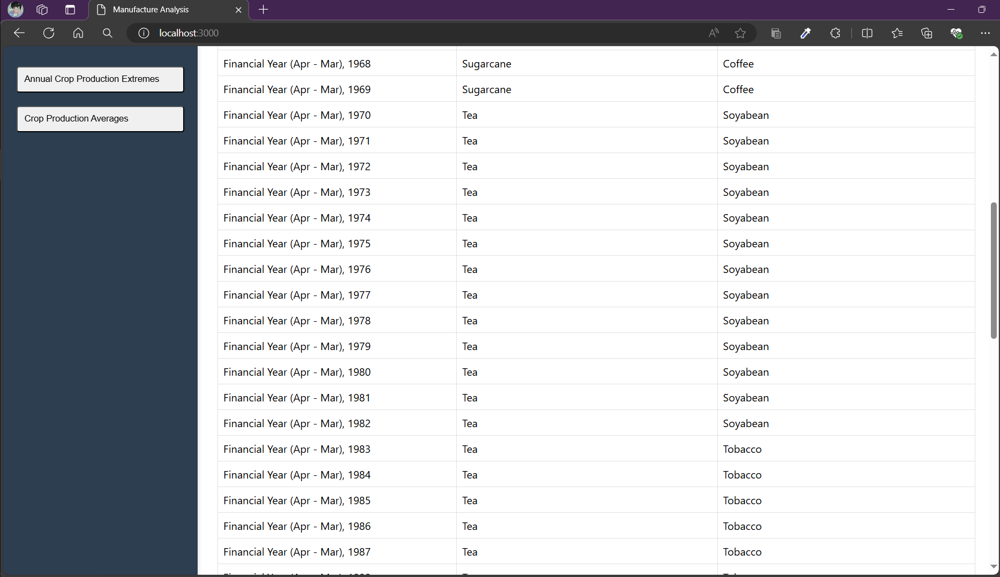
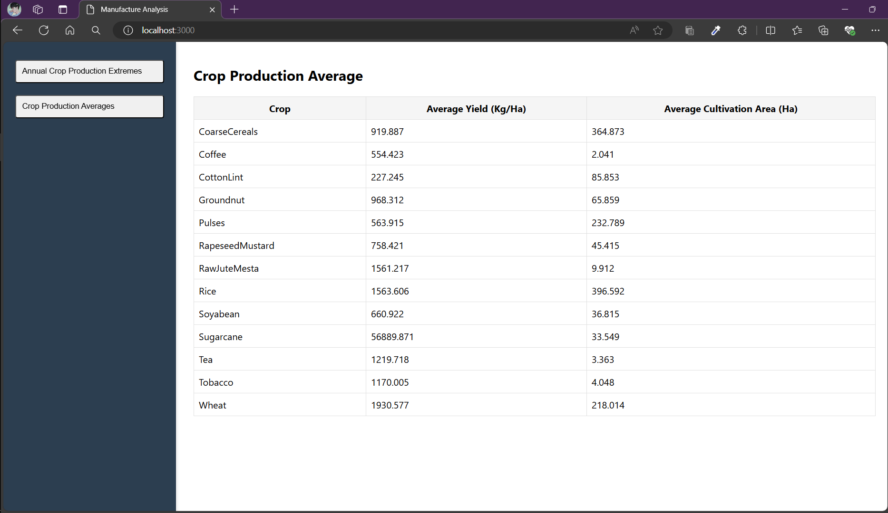

In the project directory ( cd .\Manufacture-Analysis\ ), you can run:

### `yarn install`

### `yarn start`

Images

### `Annual Max and Min Production Page1`

### `Annual Max and Min Production Page2`

### `Average Production`

